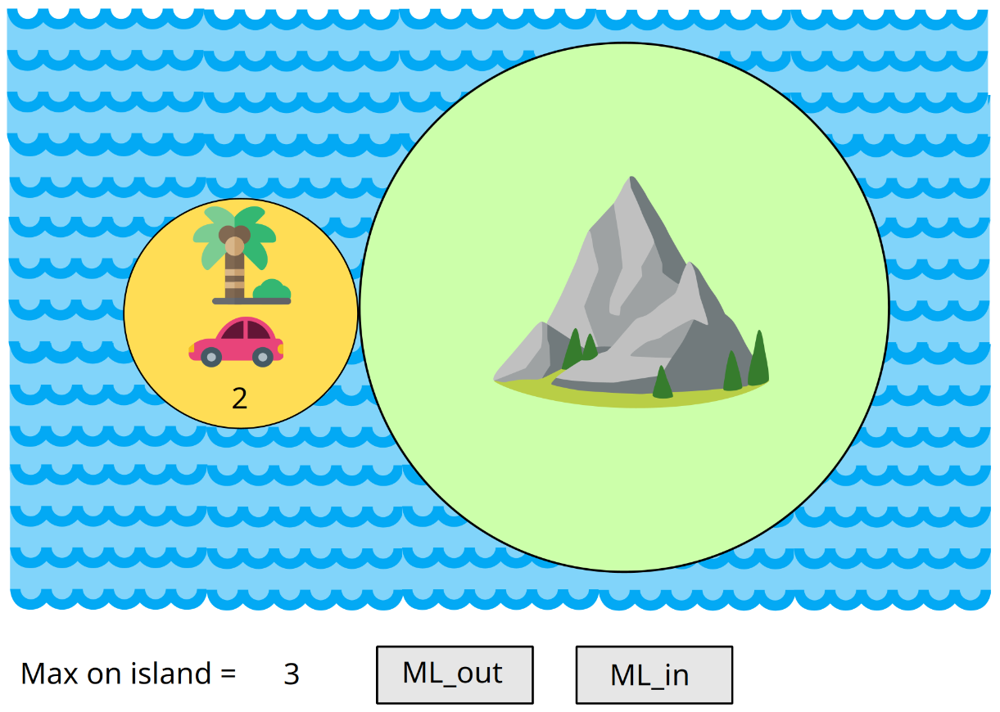
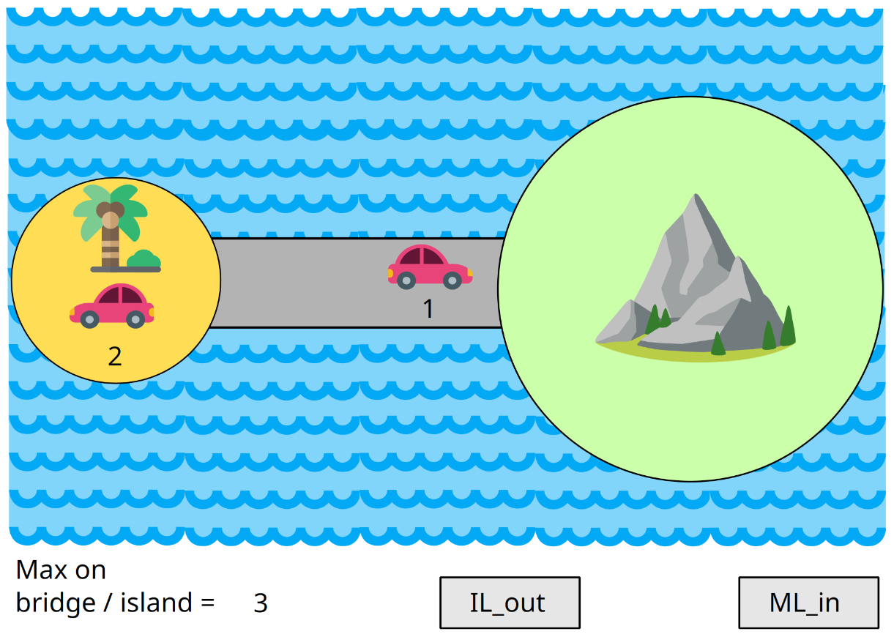
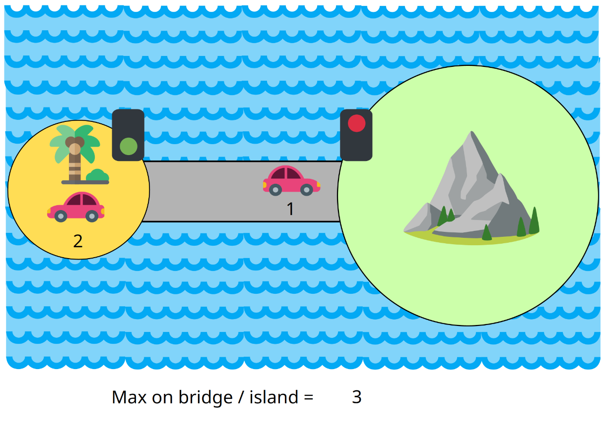
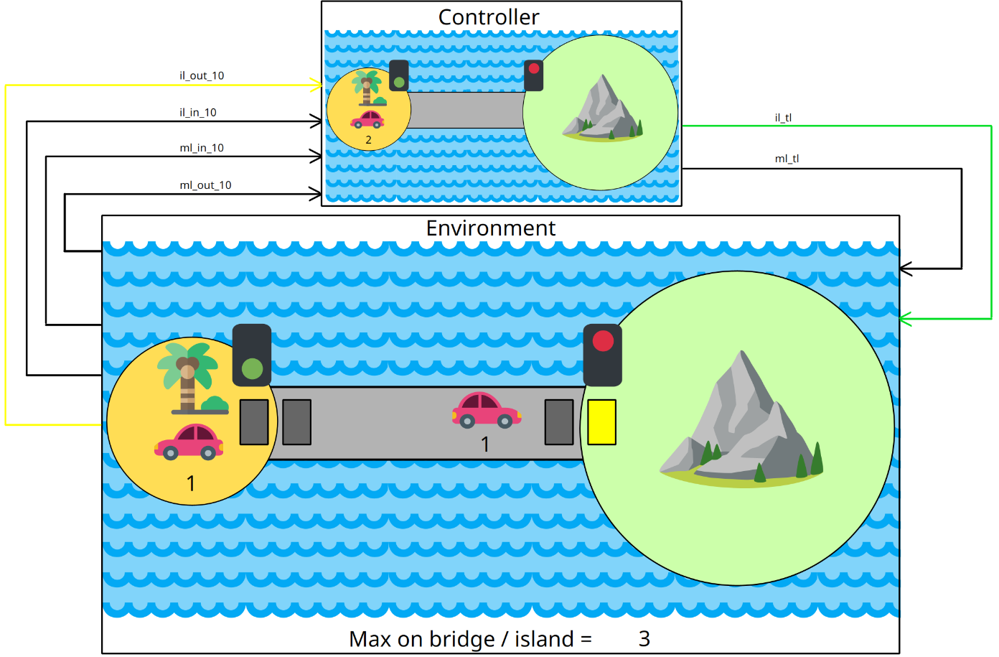

# Presentation

A visualization provides a graphical and interactive view of a machine. The user
controls the machine in a step-by-step fashion, by choosing the next event among
the possible ones. This allows one to get an intuitive understanding of a model
and sometimes to spot its inadequacies, i.e. where the model does not fit what
it is meant to describe. Such considerations belong to the (external)
meta-level, the relationship between the model and reality. On the other hand,
the proofs ensure the internal consistency of the model.

# Tools

- [ProB2-UI](https://prob.hhu.de/w/index.php?title=Download#Other_ProB_tools)
  1.3.1

# Setup

1. In ProB2-UI, open the machine file (e.g. `C0.bum`).

2. In the `Visualisation` panel, open the visualization file (e.g. `C0.json`).

3. In the `Operations` panel, choose the constant values (e.g. `d := 3`).

4. In the `Operations` panel, choose the next event (e.g. `INITIALISATION`,
   `ML_out`, etc.), or click the corresponding button in the visualization
   image, if available.

# Replayable traces

If you want an overview before installing ProB2-UI, you can replay some traces
(sequences of events) embedded in an HTML page. See the [traces/](./traces/)
subdirectory.

# Screenshots

## C0

## C1

## C2

## C3

